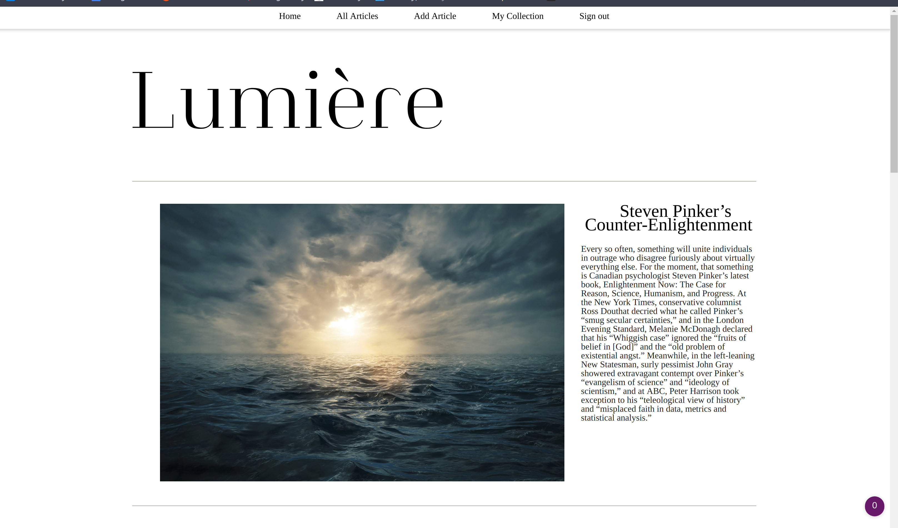

# Lumière
Provides enlightening articles.

Lumière is an alternative to sites like Medium and the majoity of legacy news outlets.
A place that contributers can publish thoughtful, enlightening articles nased on fact,
reason and science. Not emotions and feelings.

Without the pressure of a deadlines, overbearing editors and shareholders influening
the content.

## Installation

Not necessary. Web only application.

## Release History

* 0.0.1
    * Work in progress

## Meta

Luke Eaton

Distributed under the XYZ license. See ``LICENSE`` for more information.

[https://github.com/Lukeaton/skeptik)

## Contributing

1. Fork it (<https://github.com/Lukeaton/skeptik>)
2. Create your feature branch (`git checkout -b feature/fooBar`)
3. Commit your changes (`git commit -am 'Add some fooBar'`)
4. Push to the branch (`git push origin feature/fooBar`)
5. Create a new Pull Request
